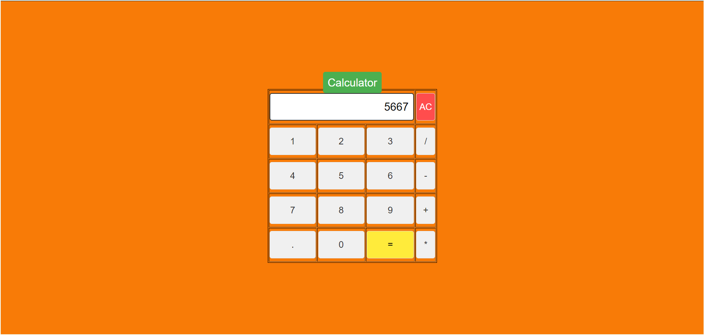

**Simple Calculator**
This is a simple calculator web application built using HTML, CSS, and JavaScript. It performs basic arithmetic operations such as addition, subtraction, multiplication, and division.

Features
Addition
Subtraction
Multiplication
Division
Clear (AC)
Decimal point input
Usage
Clone the repository:

bash
Copy code
git clone https://github.com/Chaitanya-vangipurapu/calculator.git
Open index.html in your web browser.

Use the buttons to input numbers and operators, and press '=' to calculate the result.

Preview

